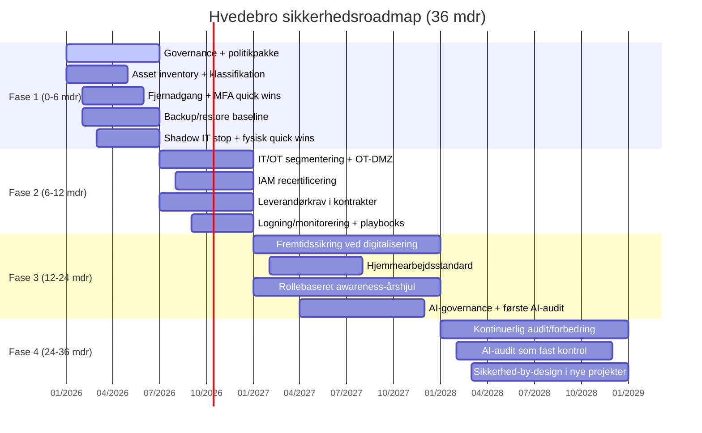

# Faseplan 1-4 (uden fase 0)

Formålet er at reducere de højeste risici først og samtidig bygge en moden, skalerbar sikkerhedspraksis.

## Tidslinje
- **Fase 1:** Måned 0-6
- **Fase 2:** Måned 6-12
- **Fase 3:** Måned 12-24
- **Fase 4:** Måned 24-36

---

## Gantt-lignende oversigt (styringsversion)

> Hvis Mermaid ikke vises i jeres miljø, brug tabellen under som fallback.

### Fallback (tekst)

| Initiativspor | F1 | F2 | F3 | F4 |
|---|---|---|---|---|
| Governance/politikker | ████ | ██ | █ | █ |
| IT/OT segmentering | ██ | ████ | █ | █ |
| Fjernadgang + IAM/MFA | ████ | ███ | ██ | █ |
| Backup/restore/beredskab | ████ | ███ | ██ | ██ |
| Leverandørstyring | ██ | ████ | ███ | ██ |
| Fysisk sikkerhed | ███ | ██ | ██ | ██ |
| Awareness/hjemmearbejde | █ | ██ | ████ | ███ |
| AI-governance/audit | - | █ | ███ | ████ |

### Faseblok-visual (til slides)

| Y-akse: områder pr. fase \ X-akse: tid | Fase 1 (0-6 mdr) | Fase 2 (6-12 mdr) | Fase 3 (12-24 mdr) | Fase 4 (24-36 mdr) |
|---|---|---|---|---|
| **Store blokke (faser)** | Fundament | Stabilisering | Fremtidssikring | Løbende forbedring |
| **Små blokke (områder)** | Governance, adgang, backup, shadow IT | Segmentering, IAM, leverandørkrav, logning | Hjemmearbejde, awareness, AI-governance | Audit, AI-audit, øvelser, security-by-design |

---

## Fase 1 – Fundament og eksponeringsreduktion (0-6 mdr)
**Mål:** Stoppe de mest kritiske sårbarheder og skabe ledelsesstyring.

**Aktiviteter:**
- I01, I02, I03 (styring, politikker, aktivoverblik)
- I05 + I08 (fjernadgang, MFA, adgangskontrol)
- I06 (backup/restore baseline)
- I07 (stop/uafhængiggør shadow IT)
- I11 (fysisk quick wins)

**Exit-kriterier:**
- Ingen ukendt OT-fjernadgang
- Kritiske systemer har verificeret restore-test
- Top 4-risici har godkendt mitigation-plan

---

## Fase 2 – Kontrolleret drift og sporbarhed (6-12 mdr)
**Mål:** Fra ad hoc til gentagende sikkerhedsdrift.

**Aktiviteter:**
- I04 (færdiggør IT/OT-segmentering)
- I09 (leverandørkrav i kontrakter)
- I10 (detektion/monitorering/playbooks)
- I08 (adgangsrecertificering)

**Exit-kriterier:**
- Kritiske hændelser detekteres og eskaleres via fast proces
- Leverandøraftaler har minimum sikkerhedskrav
- Risikoregister opdateres med behandlingstype (Mitigere/Undgå/Overføre/Acceptere)

---

## Fase 3 – Fremtidssikring ved digitalisering (12-24 mdr)
**Mål:** Gøre sikkerhed skalerbar ved vækst, hjemmearbejde og øget digitalt aftryk.

**Aktiviteter:**
- I13 (hjemmearbejdsstandard)
- I12 (rollebaseret awareness-program)
- I14 (AI-governance + AI-audit)
- Fortsat styrkelse af detektion mod BEC/deepfake/datalæk

**Fremtidsfokus:**
- Skalering af organisationen uden sikkerhedsgæld
- Mere digital kundedialog og flere integrationspunkter
- Sikker brug af AI i hverdagen

---

## Fase 4 – Moden drift og kontinuerlig forbedring (24-36 mdr)
**Mål:** Etablere dokumenterbar, vedvarende forbedringspraksis.

**Aktiviteter:**
- Intern audit/ledelsesreview i fast kadence
- AI-audit på linje med øvrige sikkerhedskontroller
- Tværgående øvelser (cyber + fysisk + drift)
- Sikkerhed-by-design i nye anlæg/projekter

**Resultatmål:**
- Modenhed omkring 3,5+
- Stabil KPI-rapportering
- Troværdig kundedialog om sikkerhed/compliance
